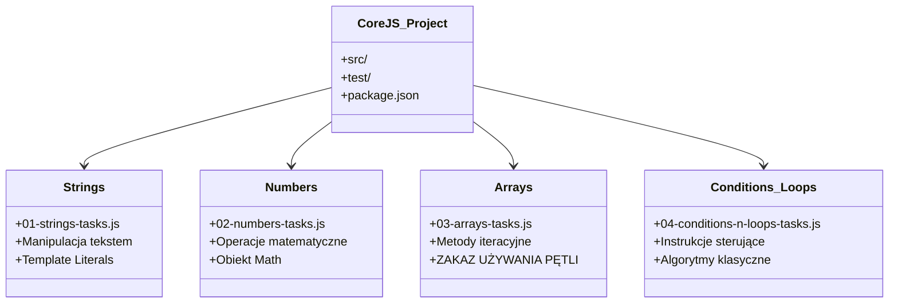
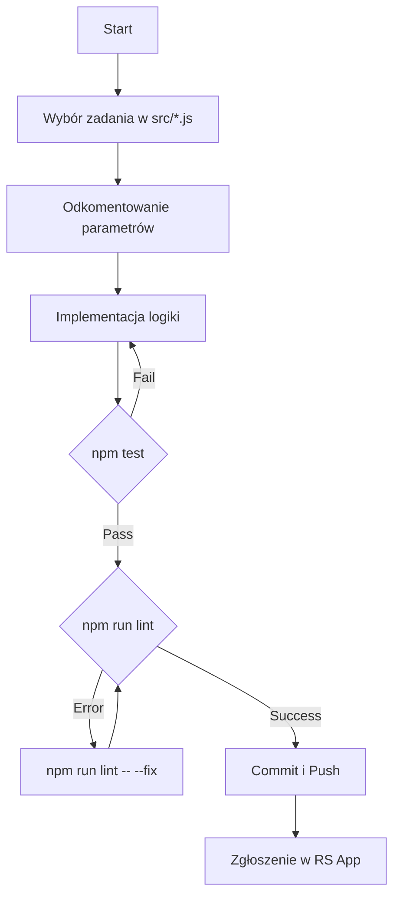

# Dokumentacja Projektu Core JS 101 (Stage 0)

## Wprowadzenie
Projekt ten jest zestawem zadań programistycznych mających na celu utrwalenie fundamentów języka JavaScript (ES6+). Zadanie polega na implementacji brakujących funkcjonalności w predefiniowanych modułach tematycznych.

## Architektura Projektu

Poniższy diagram przedstawia organizację modułów w folderze `src/`:

## Proces Deweloperski

Przepływ pracy (Workflow) dla każdego zadania wygląda następująco:

## Opis Modułów

### 1. Strings (`01-strings-tasks.js`)
Skupia się na metodach prototypu `String`. 
- **Kluczowe zagadnienia:** Konkatenacja, szablony tekstowe (backticks), wycinanie fragmentów (`slice`), zamiana znaków (`replace`).

### 2. Numbers (`02-numbers-tasks.js`)
Praca z typem prymitywnym `Number` oraz obiektem globalnym `Math`.
- **Kluczowe zagadnienia:** Zaokrąglanie, obliczanie pól i obwodów, parsowanie ciągów znaków na liczby.

### 3. Arrays (`03-arrays-tasks.js`)
**Najważniejsze ograniczenie:** Zabrania się używania pętli `for`, `while` i `do...while`. 
- **Zalecane metody:** `.map()`, `.filter()`, `.reduce()`, `.every()`, `.some()`, `.sort()`, `.flatMap()`.
- **Cel:** Nauczenie programowania deklaratywnego i funkcyjnego.

### 4. Conditions and Loops (`04-conditions-n-loops-tasks.js`)
Moduł wymagający zastosowania logiki warunkowej i iteracyjnej.
- **Kluczowe zagadnienia:** Algorytm Luhna, sprawdzanie zbalansowania nawiasów, mnożenie macierzy, logika gry Kółko i Krzyżyk.

## Standardy Jakości (Definicja Gotowości)

Aby zadanie zostało uznane za zaliczone, musi spełniać poniższe kryteria:

| Kryterium | Opis |
|-----------|------|
| **Node.js** | Kompatybilność z wersją **v22**. |
| **ESLint** | 0 błędów i 0 ostrzeżeń (brak punktów karnych). |
| **Prettier** | Kod sformatowany zgodnie z regułami projektu. |
| **Line Endings** | Zakończenia linii typu **LF** (Unix). |
| **Testy** | Wszystkie testy Mocha muszą świecić się na zielono. |

## Rozwiązywanie problemów
- **Błędy CRLF:** Uruchom `npm run lint -- --fix` w terminalu.
- **Nieskończona pętla:** Jeśli testy "wiszą", sprawdź warunki wyjścia w pętlach `while` lub `for` w module 04.
- **Metody tablicowe:** Jeśli nie wiesz jak uniknąć pętli, sprawdź dokumentację MDN dla Array.